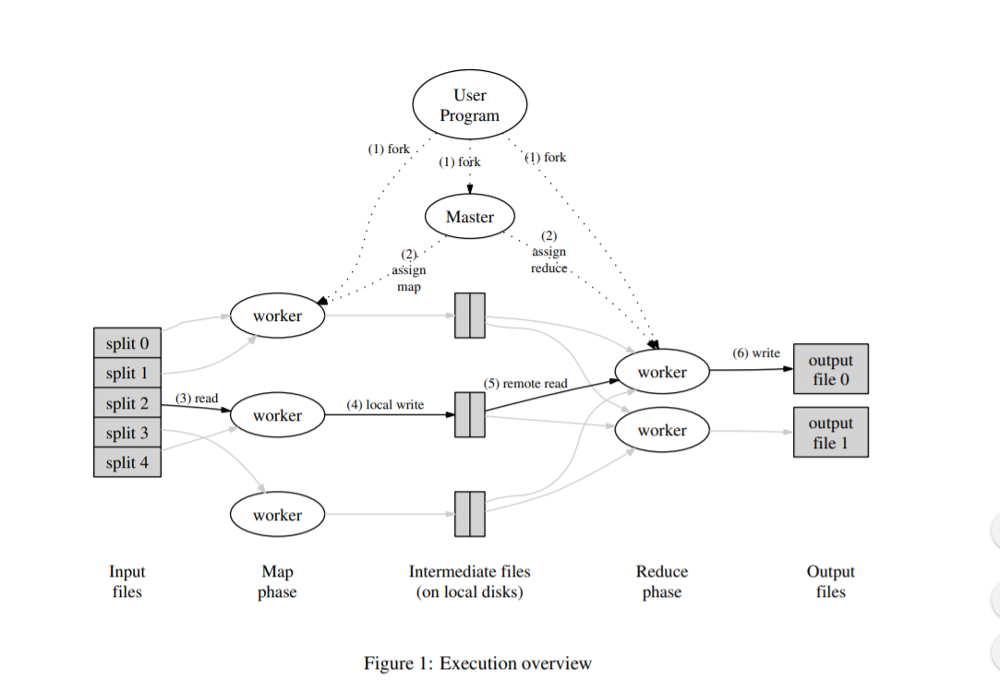

## 分布式系统

1. 分布式系统是什么？

   - 多台协作的计算机

   - 存储大型网站，MapReduce，p2p 共享网络等很多关键的基础设施是分布式的
   
2. 建设分布式系统的原因
   
- 通过并行增加容量
  
- 通过复制实现错误容忍(容错)
  

   - 使计算在物理上靠近外部实体

   
   - 通过隔离实现安全
   
3. 但是很多并发部分，复杂的交互，必须处理局部错误，难以实现性能潜力

4. 很多性能问题并不能简单通过扩展实现

   快速响应单一用户请求

   所有用户想更新相同的数据

   这些通常需要更好的设计而不仅仅是更多的服务器

5. MapReduce

   #### MapReduce 任务抽象

   
   
   ​                                                                      MapReduce 过程
   
   ```
     input is (already) split into M files
     Input1 -> Map -> a,1 b,1
     Input2 -> Map ->     b,1
     Input3 -> Map -> a,1     c,1
                       |   |   |
                       |   |   -> Reduce -> c,1
                       |   -----> Reduce -> b,2
                       ---------> Reduce -> a,2
     MR calls Map() for each input file, produces set of k2,v2
       "intermediate" data
       each Map() call is a "task"
     MR gathers all intermediate v2's for a given k2,
       and passes each key + values to a Reduce call
     final output is set of <k2,v3> pairs from Reduce()s
   
   Example: word count
     input is thousands of text files
     Map(k, v)
       split v into words
       for each word w
         emit(w, "1")
     Reduce(k, v)
       emit(len(v))
   
   MapReduce scales well:
     N "worker" computers get you Nx throughput.
    Maps()s can run in parallel, since they don't interact.
       Same for Reduce()s.
    So you can get more throughput by buying more computers.
   ```
  #### MapReduce 隐藏了很多细节:

- 发送应用代码到服务器
- 追踪哪个任务已经完成
- 将数据从 Map 移动到 Reduce
- 在服务器之间进行平衡加载调整
- 恢复失败任务

#### MapReduce 限制了应用能做的

- 没有交互或者状态(除了通过中间输出)
- 没有迭代，没有多阶段管道
- 没有做到实时数据或者流数据处理

#### 输入和输出存储在 GFS 集群文件系统中，MR 需要巨大的并行输入和输出吞吐量

- GFS 需要把大型文件分割到多个服务器上，分成 64 MB 的文件块
- Map 并行读取
- Reduce 并行写入
- GFS 也把每个文件复制到2-3个服务器上，GFS 对 MapReduce 来说是巨大的胜利

#### 限制性能的是什么？

CPU ？ 内存 ？ 硬盘 ？ 网络带宽 ？

在 2004 年他们认为是被网络带宽限制

对于排序来说，Map 从 GFS 读取文件，Reduce 读取 Map 的输出可能和 输入一样大，Reduce 再把文件写入 GFS

在 MR 的 all -to -all shuffle过程中，一半以上的流量通过根交换机

论文中的根交换机：100-200 GB/s,一共1800台服务器，也就是 55MB/s,55 Mb 很小，远低于磁盘或内存速度

今天，网络和根交换机相对于CPU /磁盘快得多

#### 论文中图 1 的详情

##### 一个主节点，将任务分配给 worker 节点并且记住任务进度

1. 主节点分给 worker节点 Map 任务直到所有的 Map 任务完成，Map 节点把输出（中间结果数据）到本地磁盘上，Map 分割输出，通过 hash分成每一个 Reduce 任务

2. 等所有 Map 完成后，主节点分发 Reduce 任务

   每一个 Reduce 从 Map worker 节点拉取 中间输出数据到 Reduce节点

   每个 Reduce 任务写入一个单独的输出文件到 GFS上

MR 如何 减小网络带宽使用

- Master节点尝试在GFS上面运行它的每个Map任务存储它的输入

  - 所有的计算机都运行 GFS 和 MR worker

  - 输入从本地磁盘读取而不是通过网络

- 中间结果数据只在网络中传输一次

  - Map 节点写入本地磁盘
  - Reduce worker节点直接从Map 节点读取，而不是通过磁盘

中间结果数据拆分为包含很多 key 的文件

- Reduce 远小于 key 的数量
- 大的网络带宽会更有效

#### MR 如何获取良好的负载均衡

如果 N -1 个服务器必须等待 1个比较慢的服务器完成任务是比较浪费的，但是一些任务耗时肯呢个远大于其他的

解决方法: 任务数比worker节点数要更多

- Master 节点 将新任务分发给完成之前任务的节点
- 因此，希望没有一项任务会大到它可以主导完成时间
- 因此，速度较快的服务器要比速度较慢的服务器执行更多任务，并同时完成。

#### 容错是什么

worker 节点在执行 MR 任务时候崩溃怎么办？

我们想要完全的向应用开发程序员隐藏错误，MR 需要重新运行整个任务吗，为何？

MR 只需要运行 失败的 Map 和 Reduce 任务

假设 MR 运行两次 Map，一个 Reduce 会看到第一次的 Map 输出结果，

另一个 Reduce 会看到第二次的运行结果

正确性要求重新执行才能产生完全相同的输出，因此 Map 和 Reduce 必须是纯粹的确定性函数，他们只被允许看到他们的参数，没有状态，没有文件 I/O,没有交互，没有额外的通信。

如果 想要允许非函数性的 Map 和 Reduce 怎么办

worker 节点失败需要整个任务重新执行，或者你需要创建全局的同步检查点

#### worker 节点崩溃恢复详情

- Map worker节点崩溃

  - master 节点注意到 worker节点不再响应 ping 
  - master 知道 哪一个 worker 节点上运行的 Map 任务
  - 那些中间结果数据现在已经丢失，必须重新创建
  - master 告诉其他节点来运行那些失败的任务
  - 如果 Reduce 已经获取到中间结果数据的话，可以忽略重新运行

- Reduce 节点崩溃

  - 任务完成就可以，存储在GFS中，同时有多个副本
  - master 在其他worker 节点上重启那些 worker 节点没有完成的任务

- 其他失败问题

  - 如果 master 给两个 worker 节点相同的 Map()  任务怎么办
  - 可能 master 错误的认为 一个 worker已经 死掉了，它会告诉 Reduce 节点只有一个 Map 任务
  - 如果 master 给两个 worker 节点相同的 Reduce() 任务怎么办
    - 他们都会尝试写入输出文件到 GFS。GFS 原子命名可防止混淆，一个完成的文件将会可见
  - 如果一个 worker 节点非常慢怎么办 ？
    - 可能是由于不可靠的硬件设备
    - master 启动最近几项任务的副本
  - woker 节点因为某种原因，计算出不正确的输出，MR 会认为停止故障的 CPU和软件
  - master 节点宕机怎么办

- 当前状态

  - 影响巨大 (hadoop, spark)

  - 可能在 Google 已经不再使用

  - 被 Flume / FlumeJava 所替代 (see paper by Chambers et al)

  -  GFS 被 Colossus 和 BigTable 替代

    

  ### 总结

  MapReduce 使得大集群计算变得流行

  不是最高效的或者最稳定的

  扩展性良好

  编程简单，失败错误和数据移动被隐藏掉了

  这些都是在实践中很好的权衡